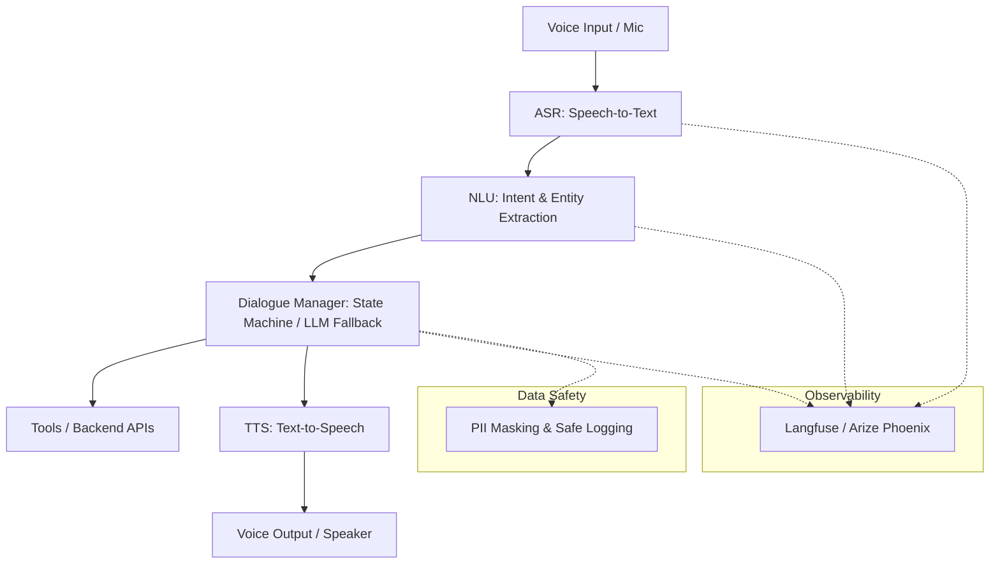

# Vani – Multilingual Voice AI Customer Support Agent

Vani is a production-quality, multilingual Voice AI Agent designed to handle customer support conversations naturally. The agent supports spoken English, Hindi, and Hinglish (code-mixed) interactions, determines user intent, extracts relevant entities, interfaces with backend APIs, and responds in real time using natural speech.

---

## 🏗️ Architecture



1. **ASR (Speech-to-Text)**: Translates user speech into text. Supports English, Hindi, and Hinglish.
2. **NLU (Natural Language Understanding)**:
   - **Intent Classification**: Covers 50+ user intents (e.g., Order Status, Refund, Delivery Delay).
   - **Entity Extraction**: Extracts keys like `Order ID`, `Phone Number`, `Email`, and `Customer Name` using regex/ML.
3. **Dialogue Manager**: Tracks conversations using a structured State Machine with LLM fallback.
4. **Tools / API Client**: Safe communication with stubbed/real backend APIs.
5. **TTS (Text-to-Speech)**: Generates highly natural audio responses.
6. **Observability & Safety**: Track and evaluate latency, steps, accuracy, while guaranteeing PII masking.

---

## 📁 Repository Structure

```text
Vani/
├── .gitignore               # Ignored files for version control
├── requirements.txt         # Project dependencies
├── README.md                # Project documentation
├── configs/                 # Configuration parameters
│   ├── config.yaml          # Main service configurations
│   └── logging_config.yaml  # Logging formats & rules
├── src/                     # Core application source
│   ├── main.py              # FastAPI application entry point
│   ├── core/                # Configuration and Logging utilities
│   ├── asr/                 # Automatic Speech Recognition stubs
│   ├── nlu/                 # Intent classification and Entity extraction
│   ├── dialogue/            # Conversational state manager
│   ├── tools/               # Integration clients for business APIs
│   ├── tts/                 # Text-to-Speech synthesis stubs
│   └── api/                 # Endpoint routing (health checkpoints, webhooks)
└── tests/                   # Automated unit and integration test suite
```

---

## ⚙️ Development Setup

### Prerequisites
- Python 3.10 or higher
- Git

### Installation
1. **Clone the repository**:
   ```bash
   git clone https://github.com/rashmisahray/Voice-First-Customer-Support-multilingual-speech-AI-.git
   cd Vani
   ```

2. **Set up the virtual environment**:
   ```bash
   python -m venv .venv
   # Activate on Windows:
   .venv\Scripts\activate
   # Activate on Unix/macOS:
   source .venv/bin/activate
   ```

3. **Install dependencies**:
   ```bash
   pip install --upgrade pip
   pip install -r requirements.txt
   ```

---

## 🚀 Running Vani

Start the FastAPI application server locally using Uvicorn:
```bash
uvicorn src.main:app --reload --port 8000
```
Once started, the API is available at:
* **API Home & Health**: `http://127.0.0.1:8000/health`
* **Swagger Documentation**: `http://127.0.0.1:8000/docs`

---

## 🧪 Running Tests
Verify the installation and core setup by running:
```bash
pytest
```
