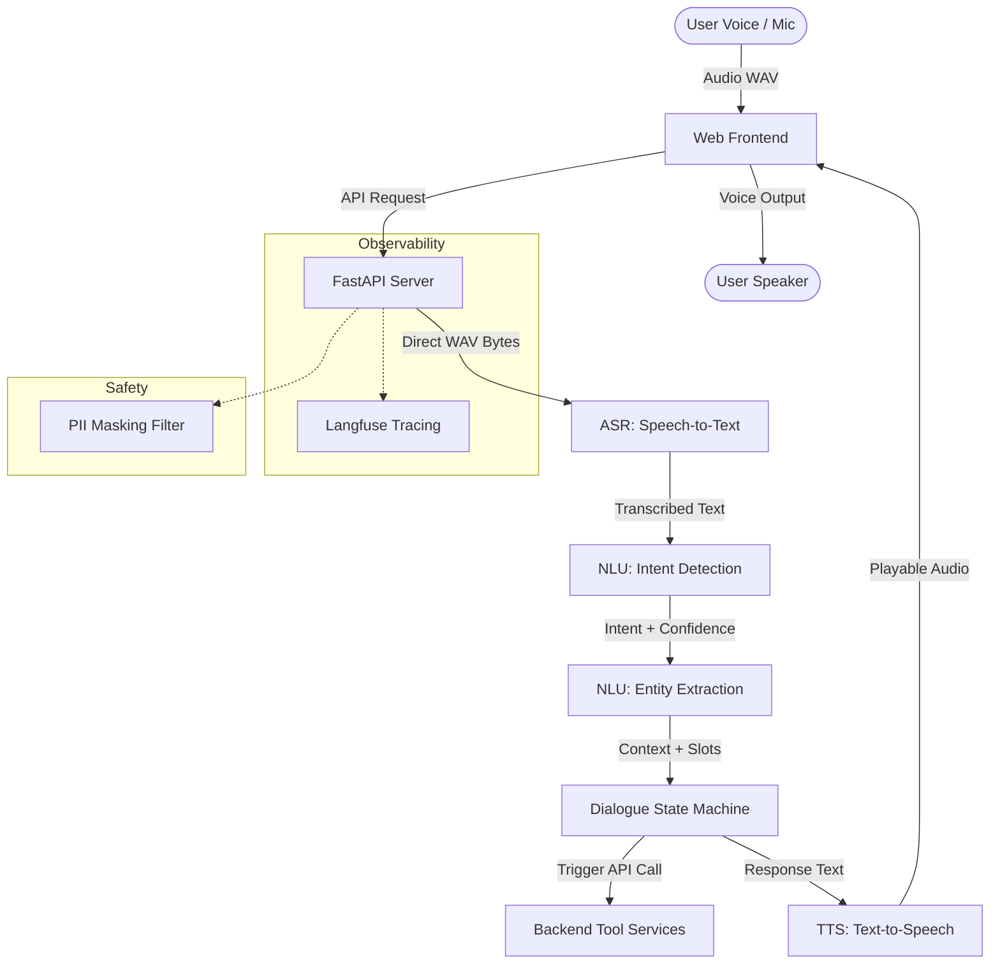

# Vani – Multilingual Voice AI Customer Support Agent

Vani is a production-quality, multilingual Voice AI Agent designed to handle customer support conversations naturally.

---

## 🚀 Week 2 Status: End-to-End Vertical Slice

We have completed the **Week 2 milestone**, building a fully functional, end-to-end vertical slice of the voice processing pipeline. Users can interact with Vani from a web interface using their microphone or by uploading a WAV file.

### Implemented Pipeline Flow


---

## 📁 Repository Structure

- [main.py](file:///c:/Users/hp/OneDrive/Desktop/Vani/src/main.py): Entrypoint, mounting the web server and serving static files.
- [routes.py](file:///c:/Users/hp/OneDrive/Desktop/Vani/src/api/routes.py): Endpoint routing (`/health`, `/api/v1/voice/process`, `/api/v1/voice/upload`).
- [whisper_asr.py](file:///c:/Users/hp/OneDrive/Desktop/Vani/src/asr/whisper_asr.py): Local CPU-optimized `faster-whisper` implementation with a custom pure Python WAV decoder.
- [classifier.py](file:///c:/Users/hp/OneDrive/Desktop/Vani/src/nlu/classifier.py): NLU Intent Classifier detecting 5 primary intents with confidence thresholds.
- [extractor.py](file:///c:/Users/hp/OneDrive/Desktop/Vani/src/nlu/extractor.py): NLU Entity Extractor resolving Order ID, phone number, email, and shipping address.
- [manager.py](file:///c:/Users/hp/OneDrive/Desktop/Vani/src/dialogue/manager.py): Dialogue state manager supporting session context tracking.
- [backend_client.py](file:///c:/Users/hp/OneDrive/Desktop/Vani/src/tools/backend_client.py): Mock database querying order status, triggering password resets, and saving address updates.
- [base.py](file:///c:/Users/hp/OneDrive/Desktop/Vani/src/tts/base.py): TTS wrapper supporting ElevenLabs and a zero-key gTTS (Google Text-to-Speech) fallback.
- [observability.py](file:///c:/Users/hp/OneDrive/Desktop/Vani/src/core/observability.py): Langfuse instrumentation middleware.
- [index.html](file:///c:/Users/hp/OneDrive/Desktop/Vani/src/static/index.html): Dark glassmorphic HTML5 frontend.
- [ADR-001.md](file:///c:/Users/hp/OneDrive/Desktop/Vani/docs/adr/ADR-001.md): Architectural Decision Record selecting Whisper/Faster-Whisper for Speech-to-Text.

---

## ⚙️ Development Setup

### Prerequisites
- Python 3.10 or higher
- Git

### Installation & Run

1. **Activate the virtual environment**:
   ```bash
   .venv\Scripts\activate
   ```

2. **Install dependencies**:
   ```bash
   pip install -r requirements.txt
   ```

3. **Start the application**:
   ```bash
   python -m uvicorn src.main:app --reload --port 8000
   ```

4. **Access the Web UI**:
   Open `http://localhost:8000/static/index.html` in your browser.

---

## 🧪 Running Tests

Verify intent classification, entity extraction, dialogue flow, and PII masking logs by running:
```bash
.venv\Scripts\pytest
```

---

## 🎙️ Demo Guidelines

Try interacting with Vani via the Web UI using these prompts (via Microphone or uploading a WAV file):
1. **Greeting**: Say *"Hello"*
   - *Result*: Vani greets you and lists features.
2. **Order Status (Slot filling)**: Say *"I want to check my order status"*
   - *Result*: Vani prompts you for your Order ID.
   - Say: *"My order ID is 876543"*
   - *Result*: Vani queries the backend database and announces: *"Order ORD-876543 is Shipped, expected on 2026-07-06."*
3. **Password Reset**: Say *"I forgot my password"*
   - *Result*: Vani asks for your email.
   - Say: *"My email is test@domain.com"*
   - *Result*: Vani triggers the reset token and reads out confirmation.
4. **Update Address**: Say *"Change shipping address"*
   - *Result*: Vani asks for verification (phone number).
   - Say: *"My phone number is 9876543210"*
   - *Result*: Vani asks for the new address.
   - Say: *"New address is 123 Blue Dart Way"*
   - *Result*: Vani triggers the update and confirms.

---

## 🛠️ Future Roadmap
- **Week 3**: Multi-lingual expansion (Hindi, Hinglish), streaming ASR, and telephony setup.
- **Week 4**: Advanced Dialogue management via LangGraph, low-latency production pipelines.
